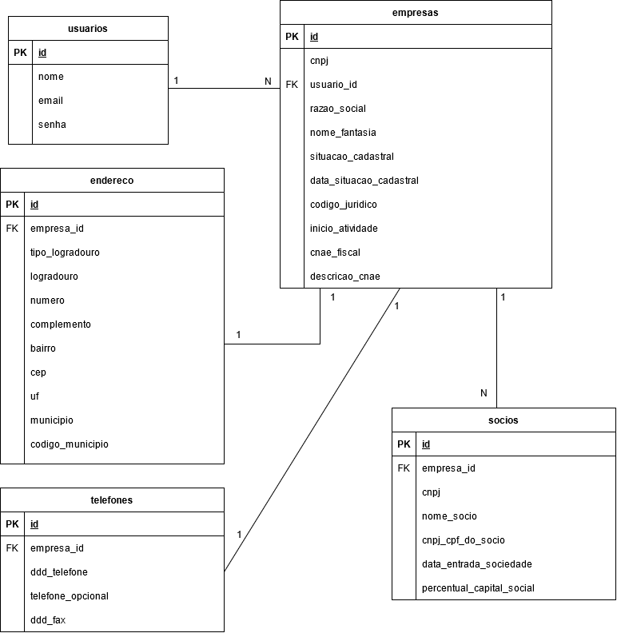

# desafio_player2

## MODELAGEM DO BANCO DE DADOS
---

**Regras importantes:** 
- Cada usuário poderá cadastrar n empresas e cada empresa deverá ter 1 usuário associado, sendo um relacionamento de 1 para N.
- Cada empresa terá 1 endereço associado, sendo um relacionamento de 1 para 1.
- Cada empresa terá 1 telefone associado, sendo um relacionamento de 1 para 1.
- Cada empresa terá N sócios associados, sendo um relacionamento de 1 para N.

Estas tabelas deverão ser:
* Usuario
* Empresas
* Endereço
* Telefones
* Sócios

### USUARIO
---

Tabela para armazenar os dados e credenciais das pessoas que poderão acessar a API.

| Coluna     | Tipo         | NOT NULL? | PK? | REFERENCES | DEFAULT   |
| --------   | --------     | --------- | --- | ---------- | -------   |
| id         | int          | Sim       | Sim |            |           |
| nome       | varchar(100) | Sim       |     |            |           |
| email      | varchar(100) | Sim       |     |            |           |
| senha      | text         | Sim       |     |            |           |

### EMPRESAS
---

Tabela para armazenar os dados das emrpesa e suas configurações.

| Coluna                   | Tipo           | NOT NULL? | PK? | REFERENCES    | DEFAULT   |
| --------                 | --------       | --------- | --- | ----------    | -------   |
| id                       | int            | Sim       | Sim |               |           |
| usuario_id               | varchar(60)    | Sim       |     | usuarios(id)  |           |
| razao_social             | varchar(100)   | Sim       |     |               |           |
| nome_fantasia            | varchar(100)   |           |     |               |           |
| situacao_cadastral       | integer        | Sim       |     | categoria(id) |           |
| data_situacao_cadastral  | varchar(60)    | Sim       |     |               |           |
| codigo_juridico          | integer        | Sim       |     |               |           |
| inicio_atividade         | varchar(100)   | Sim       |     |               |           |
| cnae_fiscal              | integer        | Sim       |     |               |           |
| descricao_cnae           | varchar(150)   | Sim       |     |               |           |

### ENDEREÇO
---

Tabela para armazenar os dados de endereço, das empresas cadastradas na API.

| Coluna              | Tipo            | NOT NULL? | PK? | REFERENCES      | DEFAULT   |
| --------            | --------        | --------- | --- | ----------      | -------   |
| id                  | int             | Sim       | Sim |                 |           |
| empresa_id          | integer         | Sim       |     | empresas(id)    |           |
| tipo_logradouro     | varchar(50)     | Sim       |     |                 |           |
| logradouro          | varchar(100)    |           |     |                 |           |
| numero              | integer         | Sim       |     |                 |           |
| complemento         | text            |           |     |                 |           |
| bairro              | varchar(60)     | Sim       |     |                 |           |
| cep                 | varchar(30)     | Sim       |     |                 |           |
| uf                  | varchar(10)     | Sim       |     |                 |           |
| municipio           | varchar(60)     | Sim       |     |                 |           |
| codigo_municipio    | integer         | Sim       |     |                 |           |

### TELEFONE
---

Tabela para armazenar os dados de telefone, das empresas cadastradas na API.

| Coluna              | Tipo            | NOT NULL? | PK? | REFERENCES      | DEFAULT   |
| --------            | --------        | --------- | --- | ----------      | -------   |
| id                  | int             | Sim       | Sim |                 |           |
| empresa_id          | integer         | Sim       |     | empresas(id)    |           |
| ddd_telefone        | varchar(20)     | Sim       |     |                 |           |
| telefone_opcional   | varchar(20)     |           |     |                 |           |
| ddd_fax             | varchar(30      | Sim       |     |                 |           |

### SOCIOS
---

Tabela para armazenar os dados de telefone, das empresas cadastradas na API.

| Coluna                        | Tipo              | NOT NULL? | PK? | REFERENCES      | DEFAULT   |
| --------                      | --------          | --------- | --- | ----------      | -------   |
| id                            | int               | Sim       | Sim |                 |           |
| empresa_id                    | integer           | Sim       |     | empresas(id)    |           |
| cnpj                          | varchar(100)      | Sim       |     |                 |           |
| nome_socio                    | varchar(100)      | Sim       |     |                 |           |
| cnpj_cpf_do_socio             | varchar(80)       |           |     |                 |           |
| data_entrada_sociedade        | varchar(50)       | Sim       |     |                 |           |
| percentual_capital_social     | integer           | Sim       |     |                 |           |

## ENDPOINTS DA API

### POST /usuarios

Endpoint para atender a funcionalidade de criar um novo usuário para a API. Ele deverá receber os dados do usuário através de objeto JSON no corpo da requisição.

---

### POST /login

Endpoint para realização de login dos usuários na API, de forma que realize:
* A validação das credenciais do usuário (e-mail e senha), retornando mensagens adequadas quando as credenciais não forem válidas.
* A autenticação dos usuários, gerando e retornando token válido como resposta.

---

### GET /empresas

Endpoint para retornar uma lista de todos as empresas cadastrados na API, pelo usuário.

---

### GET /empresas/:id

Endpoint para retornar os detalhes de uma emrpesa específica, solicitada pelo usuário. 

---

### POST /empresas

Endpoint para cadastrar uma nova empresa, através do retorno realizado pelo API externa, do Brasil API(https://brasilapi.com.br/). Deverá receber um objeto JSON, representando o CNPJ, recebendo dados da APi externa, de CNPJ já cadastrados, e realizando o cadastro dos mesmos, no banco de dados relacionado a empresas e endereço.

---

### PUT /empresas/:id

Endpoint para alterar os dados de uma empresa em específico. Deverá receber um objeto JSON representando a empresa, com os novos dados que se deseja persistir em banco de dados.

---

### PATCH /empresas/:id

Endpoint para alterar os dados parciais de uma empresa em específico. Deverá receber um objeto JSON representando a empresa, com os novos dados que se deseja persistir em banco de dados.

---

### DELETE /empresas/:id

Endpoint para excluir uma empresa existente. Não deverá receber conteúdo no corpo da requisição, mas deverá receber o ID da empresa, através de parâmetro de rota (params).